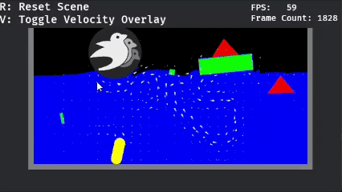
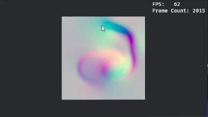

# bevy_eulerian_fluid

GPU-accelerated 2D fluid simulation plugin for [Bevy](https://bevyengine.org/) with real-time performance and good mass conservation



Try it on [here](https://narasan49.github.io/bevy_eulerian_fluid/)!

## Basic Usage
1. Add `FluidPlugin` and `PhysicsPlugins` to the app with the same length unit.
2. Spawn `FluidSettings`, then `FluidSimulationBundle` will be inserted automatically to the entity. By querying components `FluidTextures`, the simulation results can be retrieved.  

Here is a short example. See [examples](./examples/) for the detailed implementation!  

```rust
use avian2d::PhysicsPlugins;
use bevy_eulerian_fluid::{
    settings::{FluidSettings, FluidTextures},
    FluidPlugin,
};

fn main() {
    App::new()
        .add_plugins(DefaultPlugins)
        // Specify length unit same as PhysicsPlugins
        .add_plugins(FluidPlugin::new(10.0))
        .add_plugins(PhysicsPlugins::default().with_length_unit(10.0))
        .add_systems(Startup, setup_scene)
        .add_systems(Update, on_fluid_setup)
        .run();
}

fn setup_scene(
  mut commands: Commands,
  mut meshes: ResMut<Assets<Mesh>>,
) {
    commands.spawn(Camera2d);

    let mesh = meshes.add(Rectangle::from_size(Vec2::splat(512.0)));
    commands.spawn((
        FluidSettings {
            rho: 99.7, // water density in 2D
            gravity: Vec2::Y * 9.8,
            size: UVec2::splat(512),
            initial_fluid_level: 0.9,
        },
        Mesh2d(mesh),
    ));
}

fn on_fluid_setup(
    mut commands: Commands,
    query: Query<(Entity, &FluidTextures), Added<FluidTextures>>,
    mut materials: ResMut<Assets<CustomMaterial>>,
) {
    for (entity, fluid_textures) in &query {
        // Implement your own code to visualize the results.
    }
}
```

### Interact to the fluid
The simulation entity has `LocalForces` component, which holds arrays of forces (in m/s^2) and position (in pixels). forces can be applied to the simulation domain by setting `LocalForces`.

See also an [example](./examples/various_shapes.rs) for the detailed implementation.

## Features
- [x] Incompressible 2D fluid simulation
  - GPU Red-Black Gauss-Seidel pressure solve
- [x] Fluid surface
  - Level Set interface tracking
- [x] Area-fraction based fluid-rigid body two-way coupling
  - Various shape support: Circle, Rectangle, Capsule, Triangle
- [ ] Fluid source/drain
- [ ] Viscosity

## Examples
There are some examples to demonstrate how to visualize and interact with the simulation results:  
- **Fluid-Solid two-way interaction**

  ```ps1
  cargo run --example various_shapes
  ```
  

- **Imposing forces with mouse and touch input**
  ```ps1
  cargo run --example interaction
  ```
  

## Versions
| Bevy | Bevy Eulerian Fluid |
| --- | --- |
| 0.18 | 0.4 |
| 0.17 | 0.2, 0.3 |
| 0.15 | 0.1 |

## References
This simulation is inspired by and based on the algorithms described in these books, papers and source codes:

- [Fluid Simulation for Computer Graphics](https://www.amazon.co.jp/dp/1482232839) by Robert Bridson
- [GPU Gems Chapter 38](https://developer.nvidia.com/gpugems/gpugems/part-vi-beyond-triangles/chapter-38-fast-fluid-dynamics-simulation-gpu) by Mark J. Harris
- [FluidRigidCoupling2D](https://github.com/christopherbatty/FluidRigidCoupling2D) by Cristopher Batty for velocity extrapolation
- [A fast iterative method for eikonal equations](https://scholar.archive.org/work/ckx4xnjo6rbljdac4ng75mwy5a/access/wayback/http://people.seas.harvard.edu:80/~wkjeong/publication/wkjeong-sisc-fim.pdf) by Jeong, Won-Ki, and Ross T. Whitaker.

## License

Licensed under either of

 * Apache License, Version 2.0
   ([LICENSE-APACHE](LICENSE-APACHE) or http://www.apache.org/licenses/LICENSE-2.0)
 * MIT license
   ([LICENSE-MIT](LICENSE-MIT) or http://opensource.org/licenses/MIT)

at your option.

## Contribution

Unless you explicitly state otherwise, any contribution intentionally submitted
for inclusion in the work by you, as defined in the Apache-2.0 license, shall be
dual licensed as above, without any additional terms or conditions.
